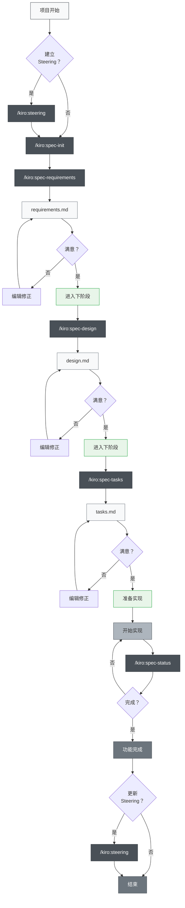
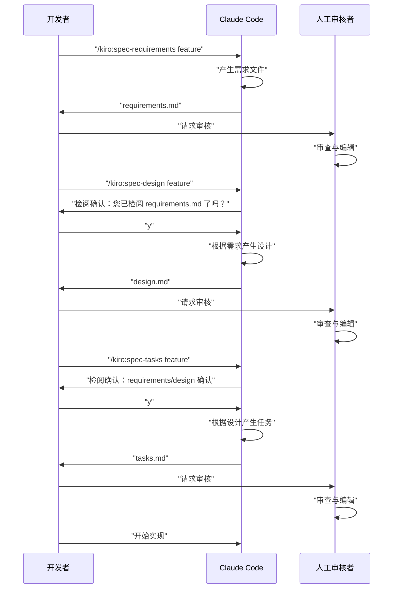

# 多平台规格驱动开发

> ⚠️ **旧版文档（已存档）。** 本页仅保存早期 cc-sdd 工作流程，最新指引请参考 [项目 README](../../README.md)。

> 🌐 **语言**  
> 📖 **[英文版](README_en.md)** | 📖 **[日本語版 README](README.md)** | 📖 **[繁体中文版](README_zh-TW.md)** | 📖 **简体中文说明**（本页）

> 🚀 **支持平台**  
> 🤖 **Claude Code** | 🔮 **Cursor** | ⚡ **Gemini CLI** | 🧠 **Codex CLI**

> [!警告]
> 这是初始版本，将随着使用逐步改进

支持 Claude Code、Cursor、Gemini CLI 及 Codex CLI 四大平台的规格驱动开发工具组。本项目在多个 AI 开发平台上重现了 Kiro IDE 的规格驱动开发流程。

**与 Kiro IDE 高度兼容** — 无缝运用现有 Kiro SDD 规格、工作流程及目录结构。

## 项目简介

本项目提供一套跨多个 AI 平台（Claude Code、Cursor、Gemini CLI、Codex CLI、GitHub Copilot、Qwen Code、Windsurf）的规格驱动开发工具组，利用 Slash Commands 让每个开发阶段都能系统化、高质量地推进，不论您偏好哪个平台。

## 安装与设置

### 集成到你的项目

根据您使用的 AI 开发平台复制对应的目录：

#### 平台专用目录
- **🤖 Claude Code**：`.claude/commands/` - Slash Commands 定义
- **🧠 Codex CLI**：`.codex/prompts/` - OpenAI Codex 提示定义
- **🔮 Cursor**：`.cursor/commands/` - Cursor 指令定义  
- **⚡ Gemini CLI**：`.gemini/commands/` - TOML 配置文件
- **🐙 GitHub Copilot**：`.github/prompts/` - Copilot 提示集合
- **🔧 Qwen Code**：`.qwen/commands/kiro/` - Qwen Code 指令定义
- **🌊 Windsurf IDE**：`.windsurf/workflows/` - Windsurf 工作流

#### 通用配置文件
- **配置文件**：根据平台复制相应的配置文件（`CLAUDE.md`、`AGENTS.md` 等）

### 初始设定步骤

1. **平台选择**：根据您的 AI 开发环境复制对应目录
2. **配置调整**：调整平台专用配置文件以符合您的项目需求
3. **执行初始指令**（各平台通用）：
   ```bash
   # 选用：建立 steering 文件
   /kiro:steering
   
   # 建立第一个功能规格
   /kiro:spec-init "请详细描述你的项目"
   ```

### 必要目录结构

执行指令后，会自动建立以下目录：

```
your-project/
├── .claude/commands/kiro/   # Claude Code 指令定义
├── .codex/prompts/          # Codex CLI 提示定义
├── .cursor/commands/kiro/   # Cursor 指令定义
├── .gemini/commands/kiro/   # Gemini CLI 设定
├── .github/prompts/         # GitHub Copilot 提示集合
├── .qwen/commands/kiro/     # Qwen Code 指令定义
├── .windsurf/workflows/     # Windsurf 工作流
├── .kiro/
│   ├── steering/            # 自动产生的 steering 文件
│   └── specs/               # 自动产生的功能规格
├── CLAUDE.md                # 由语言别文件复制并改名
└── (你的项目文件)
```

## 使用方式

### 1. 新项目

```bash
# 选用：产生 steering 文件（建议但非必须）
/kiro:steering

# 步骤1：建立新功能规格（请详细描述需求）
/kiro:spec-init "我想建立一个让使用者上传 PDF，从中提取图表并由 AI 解释内容的功能。技术栈：Next.js、TypeScript、Tailwind CSS。"

# 步骤2：需求定义（使用自动产生的功能名称）
/kiro:spec-requirements pdf-diagram-extractor
# → 编辑 .kiro/specs/pdf-diagram-extractor/requirements.md

# 步骤3：技术设计（交互式核准）
/kiro:spec-design pdf-diagram-extractor
# → 回应「您已检阅 requirements.md 了吗？ [y/N]」
# → 编辑 .kiro/specs/pdf-diagram-extractor/design.md

# 步骤4：产生实现任务（交互式核准）
/kiro:spec-tasks pdf-diagram-extractor
# → 回应 requirements 与 design 的检阅确认
# → 编辑 .kiro/specs/pdf-diagram-extractor/tasks.md

# 步骤5：开始实现
```

### 2. 为现有项目新增功能

```bash
# 选用：建立或更新 steering
# 同一指令可处理新建与更新
/kiro:steering

# 步骤1：建立新功能规格
/kiro:spec-init "请详细描述新功能"
# 后续步骤同新项目
```

### 3. 进度追踪

```bash
# 查询特定功能进度
/kiro:spec-status my-feature

# 显示目前阶段、审核状态与任务进度
```

## 规格驱动开发流程

### 流程图

在此流程中，每个阶段都需要「审查与核准」。

**Steering 文件**：记录项目持久知识（架构、技术栈、编码规范等），建立与维护 steering 文件虽非强制，但对长期维护极有帮助。



## Slash Commands 指令参考

### 🚀 阶段 0：项目 Steering（选用）

| 指令 | 目的 | 使用时机 |
|------|------|----------|
| `/kiro:steering` | 智能建立或更新 steering 文件 | 所有情况（新建和更新） |
| `/kiro:steering-custom` | 建立自定义 steering 文件 | 需特殊规范或指引时 |

**备注**：Steering 文件建议建立，但非强制。小型功能或实验性开发可省略。

#### Steering 文件类型
- **product.md**：产品概述、功能、使用情境
- **tech.md**：架构、技术栈、开发环境
- **structure.md**：目录结构、代码规范、命名规则
- **自定义文件**：API 规范、测试政策、安全政策等

### 📋 阶段 1：规格建立

| 指令 | 目的 | 使用时机 |
|------|------|----------|
| `/kiro:spec-init [详细项目描述]` | 根据描述初始化规格结构 | 新功能开发启动时 |
| `/kiro:spec-requirements [功能名称]` | 产生需求文件 | 规格初始化后立即执行 |
| `/kiro:spec-design [功能名称]` | 产生技术设计文件 | 需求审核通过后 |
| `/kiro:spec-tasks [功能名称]` | 产生实现任务 | 设计审核通过后 |

### 📊 阶段 2：进度管理

| 指令 | 目的 | 使用时机 |
|------|------|----------|
| `/kiro:spec-status [功能名称]` | 查询目前进度与阶段 | 开发过程中定期查询 |

## 三阶段审核流程

本系统核心为每个阶段都需人工审核与核准：



## 最佳实践

### ✅ 建议事项

1. **务必从 steering 开始**
   - 所有情况都使用 `/kiro:steering`（智能处理新建和更新）
   - 统一指令会适当保护现有文件并妥善处理

2. **不可跳过阶段**
   - 严格遵循：需求 → 设计 → 任务
   - 每阶段都需人工审核

3. **定期检查进度**
   - 用 `/kiro:spec-status` 掌握现状
   - 任务完成状态要及时更新

4. **维护 steering 文件**
   - 重大变更后执行 `/kiro:steering`（自动判断更新策略）
   - 随项目成长持续更新

### ❌ 避免事项

1. **未核准就进入下一阶段**
   - 务必回应确认提示

2. **忽略 steering 文件**
   - 过时信息会阻碍开发

3. **未更新任务状态**
   - 进度不明，管理困难

## 项目结构

```
.
├── .claude/
│   └── commands/          # Slash 指令定义
│       └── kiro/
│           ├── spec-init.md
│           ├── spec-requirements.md
│           ├── spec-design.md
│           ├── spec-tasks.md
│           ├── spec-status.md
│           ├── steering.md          # 统一 steering 指令
│           └── steering-custom.md
├── .kiro/
│   ├── steering/          # Steering 文件
│   │   ├── product.md
│   │   ├── tech.md
│   │   └── structure.md
│   └── specs/             # 功能规格
│       └── [feature-name]/
│           ├── spec.json      # 阶段核准状态
│           ├── requirements.md # 需求文件
│           ├── design.md      # 技术设计文件
│           └── tasks.md       # 实现任务
├── CLAUDE.md              # 主要设定（可依项目语言复制自下方任一语言文件）
├── CLAUDE_zh-TW.md        # 繁体中文版 Claude Code 设定
├── CLAUDE_en.md           # 英文版 Claude Code 设定
├── README.md              # 日文版 README
├── README_en.md           # 英文版 README
├── README_zh-TW.md        # 繁体中文版 README
└── (你的项目文件)
```

## 自动化功能

以下功能由 Claude Code 的 hook 自动实现：

- 任务进度自动追踪
- 规格符合性检查
- 压缩时保留上下文
- Steering 漂移检测

## 疑难解答

### 指令无法运作时
1. 检查 `.claude/commands/` 目录是否存在
2. 确认指令文件命名规则（`command-name.md`）
3. 确保使用最新版 Claude Code

### 卡在审核流程时
1. 确认是否正确回应检阅确认提示
2. 确认前一阶段已核准
3. 用 `/kiro:spec-status` 诊断目前状态
4. 必要时手动检查/编辑 spec.json

## 摘要

Claude Code 的 Slash Commands 让规格驱动开发具备：

- 📐 系统化开发流程
- ✅ 分阶段审核确保质量
- 📊 透明进度管理
- 🔄 文件持续更新
- 🤖 AI 助力提升效率

善用此系统，能大幅提升开发质量与效率。
