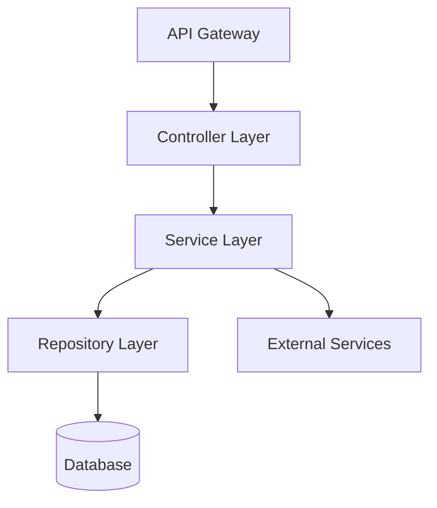

# Customization Guide

> 📖 **简体中文版:** [自定义指南](customization-guide-zh.md) | 📖 日本語版はこちら: [カスタマイゼーションガイド](ja/customization-guide.md)

This guide explains how to edit cc-sdd's templates and rules to adapt to your team's specific workflow.

## Introduction

cc-sdd provides two customization points:

- **templates/** - Define the **structure and format** of AI-generated documents
- **rules/** - Define the **judgment criteria and generation principles** for AI

Both are located under `{{KIRO_DIR}}/settings/` and are shared across the entire project.

---

## Two Approaches to Customization

### 📄 templates/ - Customize Output Format

**Location**: `{{KIRO_DIR}}/settings/templates/specs/`

**Role**: Defines the **document structure** that AI generates. Sections and fields added to templates will be automatically filled in by the AI.

**Files to Edit**:
- `requirements.md` - Requirements document structure
- `design.md` - Design document structure
- `tasks.md` - Task breakdown structure

**Customization Examples**:
- Add PRD-style sections (Product Overview, Success Metrics, etc.)
- Add approval checklists
- Add JIRA fields

---

### 📋 rules/ - Customize AI Judgment Criteria

**Location**: `{{KIRO_DIR}}/settings/rules/`

**Role**: Defines AI's **generation rules and principles**. Editing rules changes AI's judgment criteria and generation style.

**Files to Edit**:
- `ears-format.md` - EARS format requirement description rules
- `design-principles.md` - Design principles and documentation standards
- `tasks-generation.md` - Task breakdown granularity and structure rules
- `tasks-parallel-analysis.md` - Criteria for determining parallel executability
- Others (`design-discovery-*.md`, `gap-analysis.md`, etc.)

**Customization Examples**:
- Adjust task granularity (1-3 hours → 4-8 hours, etc.)
- Add design principles (security, performance requirements, etc.)
- Requirement priority determination criteria

---

## 🚨 Structure That Must Be Maintained

cc-sdd commands read and understand documents through AI agents. The following elements **must be maintained**:

| File | Required Elements | Reason |
|------|-------------------|--------|
| **requirements.md** | Numbered criteria (`1.`, `2.`, `3.`...) | AI recognizes the number and structure of criteria |
| | Consistency with template | AI learns structure from template |
| **design.md** | **File existence** | Commands read this file |
| **tasks.md** | `- [ ] N.` checkbox format | Task execution engine recognizes this |
| | `_Requirements: X, Y_` references | Requirement traceability |
| | Hierarchical structure (1, 1.1, 1.2...) | Dependency analysis |

**Important**: Headings in requirements.md can be freely changed. AI learns the structural pattern defined in the template and generates using the same pattern.

### ✅ requirements.md Flexibility (Important)

requirements.md is very flexible for customization:

#### 1. Heading Name Customization

**Heading names can be freely changed**. AI learns the structure from the template:

- ✅ **English**: `### Requirement 1:` / `#### Acceptance Criteria`
- ✅ **Localized**: `### Requirement 1:` / `#### Acceptance Criteria` (any language supported)
- ✅ **Custom**: `### REQ-1:` / `#### Verification Criteria`

**Key Points**:
- Maintain numbering pattern (`N:` where N is the number)
- Maintain hierarchy (`###` and `####`)
- Keep consistency between template and generated files

#### 2. Acceptance Criteria Description Format

**EARS format is recommended but not mandatory**:

- ✅ **EARS format recommended**: `WHEN [event] THEN [system] SHALL [action]` - Default for AI generation
- ✅ **Other formats are acceptable**:
  - Simple format: `System responds to XX`
  - BDD format: `GIVEN [context] WHEN [event] THEN [outcome]`
  - Custom format: Your team's own template
- ✅ **Numbering is important**: Content is free as long as the format `1.`, `2.`, `3.` is maintained

**Benefits of EARS format**:
- High testability (clear conditions and expected results)
- Easy for AI to understand (improves accuracy of design/tasks generation)
- Industry standard (easy for reviewers to read)

**Only structure is mandatory**: AI learns structural patterns but does not parse specific strings.

### 🎯 requirements.md Customization Examples

#### Example 1: Localized Headings + EARS Format

```markdown
### Requirement 1: User Authentication

#### Acceptance Criteria
1. WHEN user clicks login button THEN system displays authentication screen
2. IF invalid credentials are entered THEN system displays error message
3. WHILE authentication is in progress THEN system displays loading indicator
```

**Template Setting**:
```markdown
# templates/specs/requirements.md
### Requirement 1: {{REQUIREMENT_AREA_1}}
#### Acceptance Criteria
```

**Note**: Headings can be in any language (English, Japanese, etc.) as AI learns the structure pattern from the template.

#### Example 2: English Headings + BDD Format

```markdown
### Requirement 1: User Authentication

#### Acceptance Criteria
1. GIVEN user is on login page WHEN clicks login button THEN authentication screen is displayed
2. GIVEN invalid credentials WHEN attempting login THEN error message is displayed
3. GIVEN authentication in progress WHEN displaying screen THEN loading indicator is displayed
```

#### Example 3: Custom ID + Simple Format

```markdown
### REQ-001: User Authentication

#### Verification Criteria
1. When user clicks login button, system displays authentication screen
2. When invalid credentials are entered, system displays error message
3. During authentication processing, system displays loading indicator
```

**Template Setting**:
```markdown
# templates/specs/requirements.md
### REQ-001: {{REQUIREMENT_AREA_1}}
#### Verification Criteria
```

#### Example 4: Default (English Headings + EARS Format)

```markdown
### Requirement 1: User Authentication

#### Acceptance Criteria
1. WHEN user clicks login button THEN system displays authentication screen
2. IF invalid credentials are entered THEN system displays error message
3. WHILE authentication is in progress THEN system displays loading indicator
```

**✅ All these formats are valid.** Heading names and ID formats are defined in the template, and description formats (EARS/BDD/Simple) are adjusted in rules.

### ✅ design.md Flexibility (Important)

**design.md has almost no content constraints**. You can freely customize it to match your team's review process and analysis tools:

- ✅ **Heading names are free**: `## Architecture`, `## System Design`, `## Technical Design`, etc. can be changed to any language or style
- ✅ **Heading order is also free**: Place requirement traceability at the top, data model near architecture, etc.
- ✅ **Add/remove sections**: Add team-specific review items, remove unnecessary sections
- ✅ **Format changes**: Tables, bullet points, diagrams, etc. can be freely chosen

**About Mermaid diagrams**: Basic syntax rules are defined in `{{KIRO_DIR}}/settings/rules/design-principles.md`, not in template constraints. You can change diagram requirements by editing the rules file.

**Only file existence is mandatory**: Commands read `design.md` but do not parse specific headings or formats.

### 🎯 design.md Customization Examples

#### Example 1: Align with Internal Review Process

```markdown
## 1. Overview (Required)
## 2. Business Requirements Alignment (Required)
## 3. Security Review (Required)
## 4. Architecture Design (Required)
## 5. Performance Verification (P0 features only)
## 6. Approval
```

#### Example 2: Analysis Tool Integration

```markdown
## Design-ID: FEAT-2024-001
## Trace-Matrix
| Req ID | Design Element | Test ID | Implementation File |
|--------|----------------|---------|-------------------|
| REQ-1 | Component A | TEST-1 | src/a.ts |

## Architecture
...
```

#### Example 3: Localized Headings

```markdown
## Overview
## System Architecture
## Module Design
## Data Structure
## Error Handling
## Testing Strategy
```

**Note**: Headings can be in any language. The structure is what matters, not the specific wording.

**✅ All these customizations are valid.** Commands are not affected.

---

## Customization Procedure (3 Steps)

### Step 1: Check Default Templates

```bash
# Check template location
ls -la {{KIRO_DIR}}/settings/templates/specs/
ls -la {{KIRO_DIR}}/settings/rules/
```

### Step 2: Add/Edit While Maintaining Structure

- **templates/**: Add sections and fields
- **rules/**: Add principles and criteria

### Step 3: Verify with Test Execution

```bash
# Test with new spec
/kiro:spec-init Test customization feature
/kiro:spec-requirements test-customization
/kiro:spec-design test-customization
/kiro:spec-tasks test-customization

# Check generated files
cat {{KIRO_DIR}}/specs/test-customization/requirements.md
cat {{KIRO_DIR}}/specs/test-customization/design.md
cat {{KIRO_DIR}}/specs/test-customization/tasks.md
```

---

## Practical Scenarios

We present 3 representative customization scenarios tailored to team-specific needs. Each scenario includes complete copy-paste code and testing methods.

---

## Scenario 1: PRD-Style Requirements

### 📋 Customization Target

- **templates**: `{{KIRO_DIR}}/settings/templates/specs/requirements.md`
- **rules**: `{{KIRO_DIR}}/settings/rules/ears-format.md` (Optional)

### 🎯 Use Cases

- Product/business teams participate as stakeholders
- Business context, priority, and success metrics are mandatory in requirement reviews
- Many non-engineer reviewers

### 🔧 Customization Steps

#### Step 1: Template Editing (Required)

**File to Edit**: `{{KIRO_DIR}}/settings/templates/specs/requirements.md`

**🔒 Structure to Maintain**:
- Numbered heading pattern (e.g., `### Requirement N:`, `### REQ-N:`, or localized equivalents)
- Criteria section heading (e.g., `#### Acceptance Criteria`, or localized equivalents)
- Numbered criteria (`1.`, `2.`, `3.`...)

**💡 Heading names are free**: If defined in the template, AI generates using the same pattern.
**💡 Recommendation**: Using EARS format (`WHEN ... THEN ...`) improves AI generation accuracy, but other formats are also usable.

**➕ Complete Template to Add**:

<details>
<summary><strong>Copy-Pasteable Complete Template</strong></summary>

```markdown
# Requirements Document

## Product Context

**Problem Statement**: {{PROBLEM_DESCRIPTION}}

**Target Users**: {{TARGET_USERS}}

**Success Metrics**: {{SUCCESS_METRICS}}

**Timeline**: {{TIMELINE}}

**Business Impact**: {{BUSINESS_IMPACT}}

---

## Requirements

### Requirement 1: {{REQUIREMENT_AREA_1}}

**Objective**: As a {{ROLE}}, I want {{CAPABILITY}}, so that {{BENEFIT}}

**Business Priority**: P0 (Critical) / P1 (High) / P2 (Medium)

**Dependencies**: {{DEPENDENCIES}}

**Risk Level**: Low / Medium / High

#### Acceptance Criteria

1. WHEN {{EVENT}} THEN the {{SYSTEM}} SHALL {{RESPONSE}}
2. IF {{CONDITION}} THEN the {{SYSTEM}} SHALL {{RESPONSE}}
3. WHERE {{FEATURE_INCLUDED}} THE {{SYSTEM}} SHALL {{RESPONSE}}

**Verification Method**: {{TEST_TYPE}}

**Success Threshold**: {{THRESHOLD}}

---

### Requirement 2: {{REQUIREMENT_AREA_2}}

**Objective**: As a {{ROLE}}, I want {{CAPABILITY}}, so that {{BENEFIT}}

**Business Priority**: P0 / P1 / P2

**Dependencies**: {{DEPENDENCIES}}

**Risk Level**: Low / Medium / High

#### Acceptance Criteria

1. WHEN {{EVENT}} THEN the {{SYSTEM}} SHALL {{RESPONSE}}
2. WHEN {{EVENT}} AND {{CONDITION}} THEN the {{SYSTEM}} SHALL {{RESPONSE}}

**Verification Method**: {{TEST_TYPE}}

**Success Threshold**: {{THRESHOLD}}

<!-- Additional requirements continue with same pattern -->

---

## Non-Functional Requirements

### Requirement NFR-1: Performance

**Objective**: System responsiveness and scalability

#### Acceptance Criteria

1. WHEN page loads THEN system SHALL respond within 2 seconds
2. WHEN API called THEN system SHALL respond within 200ms
3. WHEN {{CONCURRENT_USERS}} users access THEN system SHALL maintain response time

**Verification Method**: Load testing

**Success Threshold**: 95th percentile < 200ms

---

### Requirement NFR-2: Security

**Objective**: Data protection and access control

#### Acceptance Criteria

1. WHEN user authenticates THEN system SHALL enforce MFA
2. WHEN data stored THEN system SHALL encrypt at rest
3. WHEN data transmitted THEN system SHALL use TLS 1.3

**Verification Method**: Security audit

**Success Threshold**: Zero critical vulnerabilities

---

## Compliance & Approvals

**Compliance Requirements**: {{COMPLIANCE_LIST}}

**Review Checklist**:
- [ ] Product team reviewed
- [ ] Business stakeholder approved
- [ ] Legal/Compliance reviewed
- [ ] Security team approved

**Approval History**:
- Product Owner: {{APPROVER_NAME}} - {{DATE}}
- Engineering Lead: {{APPROVER_NAME}} - {{DATE}}
```

</details>

#### Step 2: Rules Adjustment (Optional - for stricter control)

**File to Edit**: `{{KIRO_DIR}}/settings/rules/ears-format.md`

**Content to Add**:

<details>
<summary><strong>Rules File Addition</strong></summary>

```markdown
## PRD-Specific Requirements

### Business Context Requirements

Every requirement MUST include:

- **Priority**: P0 (Critical) / P1 (High) / P2 (Medium)
  - P0: Blocking launch, must have
  - P1: Important for launch, strong preference
  - P2: Nice to have, can defer

- **Timeline**: Target delivery date or sprint number

- **Success Metrics**: Quantifiable measurement
  - User engagement metrics
  - Performance benchmarks
  - Business KPIs

### Verification Standards

Each acceptance criterion MUST specify:

- **Verification Method**:
  - Unit test
  - Integration test
  - Manual QA
  - Acceptance test
  - Performance test
  - Security audit

- **Success Threshold**: Specific measurable value
  - Examples: "< 200ms", "> 95% uptime", "Zero critical bugs"

### Non-Functional Requirements

Always include NFR sections for:
- Performance (response time, throughput)
- Security (authentication, encryption, access control)
- Scalability (concurrent users, data volume)
- Reliability (uptime, error rates)
- Usability (accessibility, UX metrics)
```

</details>

### ✅ Behavior After Completion

When you run `/kiro:spec-requirements my-feature`:

1. **Product Context** section is automatically generated
2. Each requirement includes **Business Priority**, **Dependencies**, **Risk Level**
3. **Verification Method** and **Success Threshold** are added to each requirement
4. **Non-Functional Requirements** section is automatically generated
5. **Compliance & Approvals** checklist is added
6. Requirement numbering and acceptance criteria structure are maintained (compatible with `/kiro:spec-impl`)

### 🧪 Testing Method

```bash
# 1. Edit template
vim {{KIRO_DIR}}/settings/templates/specs/requirements.md

# 2. (Optional) Edit rules
vim {{KIRO_DIR}}/settings/rules/ears-format.md

# 3. Check with new spec
/kiro:spec-init Test PRD-style requirements with business context
/kiro:spec-requirements test-prd-feature

# 4. Check generated requirements.md
cat {{KIRO_DIR}}/specs/test-prd-feature/requirements.md

# 5. Verify Product Context, Priority, NFR sections are included
grep -A 5 "## Product Context" {{KIRO_DIR}}/specs/test-prd-feature/requirements.md
grep "Business Priority" {{KIRO_DIR}}/specs/test-prd-feature/requirements.md
grep -A 3 "## Non-Functional Requirements" {{KIRO_DIR}}/specs/test-prd-feature/requirements.md
```

---

## Scenario 2: Backend/API-Focused Design Document

### 📋 Customization Target

- **templates**: `{{KIRO_DIR}}/settings/templates/specs/design.md`
- **rules**: `{{KIRO_DIR}}/settings/rules/design-principles.md` (Optional)

### 🎯 Use Cases

- REST/GraphQL API development
- Microservices architecture
- Database design and schema definition are important

### 🔧 Customization Steps

#### Step 1: Template Editing (Required)

**File to Edit**: `{{KIRO_DIR}}/settings/templates/specs/design.md`

**🔒 Structure to Maintain**:
- **File existence only** - Heading names, order, and formats are all free

**➕ Sections to Add**:

<details>
<summary><strong>Backend-Focused Template (Additional Parts)</strong></summary>

Add the following sections to existing `design.md`:

```markdown
## API Specification

### Base Configuration

**Base URL**: `{{BASE_URL}}`

**API Version**: `v{{VERSION}}`

**Authentication**: Bearer token (JWT) / API Key / OAuth 2.0

**Rate Limiting**: {{RATE_LIMIT}} requests per {{TIME_WINDOW}}

---

### Endpoints

#### POST /api/v1/{{resource}}

**Description**: {{ENDPOINT_DESCRIPTION}}

**Authentication**: Required

**Request Headers**:
```http
Authorization: Bearer {{token}}
Content-Type: application/json
```

**Request Body**:
```json
{
  "field1": "string",
  "field2": 123,
  "field3": {
    "nestedField": "value"
  }
}
```

**Request Validation**:
- `field1`: Required, string, max 255 characters
- `field2`: Required, integer, range 1-1000
- `field3.nestedField`: Optional, string

**Response (200 OK)**:
```json
{
  "data": {
    "id": "uuid",
    "field1": "string",
    "field2": 123,
    "createdAt": "ISO 8601 timestamp"
  },
  "meta": {
    "timestamp": "ISO 8601",
    "requestId": "uuid"
  }
}
```

**Error Responses**:

- **400 Bad Request**:
```json
{
  "error": {
    "code": "INVALID_INPUT",
    "message": "Validation failed",
    "details": {
      "field1": ["Required field missing"]
    }
  }
}
```

- **401 Unauthorized**:
```json
{
  "error": {
    "code": "UNAUTHORIZED",
    "message": "Invalid or expired token"
  }
}
```

- **429 Too Many Requests**:
```json
{
  "error": {
    "code": "RATE_LIMIT_EXCEEDED",
    "message": "Too many requests",
    "retryAfter": 60
  }
}
```

**Rate Limiting Headers**:
```http
X-RateLimit-Limit: 100
X-RateLimit-Remaining: 95
X-RateLimit-Reset: 1640000000
```

---

#### GET /api/v1/{{resource}}/:id

**Description**: {{ENDPOINT_DESCRIPTION}}

**Authentication**: Required

**Path Parameters**:
- `id`: UUID, required

**Query Parameters**:
- `include`: Comma-separated list of related resources
- `fields`: Comma-separated list of fields to return

**Response (200 OK)**:
```json
{
  "data": {
    "id": "uuid",
    "...": "..."
  }
}
```

**Error Responses**:
- **404 Not Found**: Resource does not exist

---

### Pagination

**Strategy**: Cursor-based / Offset-based

**Request**:
```http
GET /api/v1/{{resource}}?page=1&limit=20&sort=createdAt:desc
```

**Response**:
```json
{
  "data": [...],
  "meta": {
    "total": 150,
    "page": 1,
    "limit": 20,
    "totalPages": 8
  },
  "links": {
    "first": "{{url}}?page=1",
    "prev": null,
    "next": "{{url}}?page=2",
    "last": "{{url}}?page=8"
  }
}
```

---

## Database Schema

### Tables

#### {{table_name}}

**Schema**:
```sql
CREATE TABLE {{table_name}} (
  id UUID PRIMARY KEY DEFAULT gen_random_uuid(),
  field1 VARCHAR(255) NOT NULL,
  field2 INTEGER NOT NULL CHECK (field2 >= 0),
  field3 JSONB,
  status VARCHAR(50) NOT NULL DEFAULT 'active',
  created_at TIMESTAMP WITH TIME ZONE NOT NULL DEFAULT NOW(),
  updated_at TIMESTAMP WITH TIME ZONE NOT NULL DEFAULT NOW(),
  deleted_at TIMESTAMP WITH TIME ZONE,

  CONSTRAINT {{constraint_name}} UNIQUE (field1)
);
```

**Indexes**:
```sql
CREATE INDEX idx_{{table_name}}_field1 ON {{table_name}} (field1);
CREATE INDEX idx_{{table_name}}_status ON {{table_name}} (status) WHERE deleted_at IS NULL;
CREATE INDEX idx_{{table_name}}_created_at ON {{table_name}} (created_at DESC);
```

**Foreign Keys**:
```sql
ALTER TABLE {{table_name}}
  ADD CONSTRAINT fk_{{relation}}
  FOREIGN KEY ({{foreign_key_column}})
  REFERENCES {{referenced_table}} (id)
  ON DELETE CASCADE;
```

---

### Relationships

```mermaid
erDiagram
    {{TABLE1}} ||--o{ {{TABLE2}} : "has many"
    {{TABLE2}} }o--|| {{TABLE3}} : "belongs to"
```

**Relationship Description**:
- {{TABLE1}} has many {{TABLE2}}: {{DESCRIPTION}}
- {{TABLE2}} belongs to {{TABLE3}}: {{DESCRIPTION}}

---

## Service Architecture

### Service Layers



**Layer Responsibilities**:
- **Controller**: Request validation, response formatting
- **Service**: Business logic, transaction management
- **Repository**: Data access, query building
- **External Services**: Third-party API integration

---

## Caching Strategy

### Cache Layers

1. **Application Cache** (Redis)
   - Key pattern: `{{key_pattern}}`
   - TTL: {{TTL}}
   - Invalidation: {{INVALIDATION_STRATEGY}}

2. **Database Query Cache**
   - Cached queries: {{QUERY_LIST}}
   - TTL: {{TTL}}

3. **CDN Cache** (if applicable)
   - Cached assets: {{ASSET_LIST}}
   - TTL: {{TTL}}

### Cache Invalidation

**Strategies**:
- Time-based: {{DESCRIPTION}}
- Event-based: {{DESCRIPTION}}
- Manual: {{DESCRIPTION}}

---

## Security

### Authentication & Authorization

**Authentication Method**: JWT / OAuth 2.0 / API Key

**Token Structure**:
```json
{
  "sub": "user_id",
  "exp": 1640000000,
  "roles": ["admin", "user"],
  "permissions": ["read:resource", "write:resource"]
}
```

**Authorization Model**: RBAC / ABAC

**Protected Resources**:
- {{RESOURCE_1}}: Requires {{PERMISSION}}
- {{RESOURCE_2}}: Requires {{PERMISSION}}

---

### Input Validation

**Validation Rules**:
- Sanitize all user inputs
- Whitelist allowed characters
- Validate data types and ranges
- Prevent SQL injection, XSS, CSRF

**Validation Library**: {{LIBRARY_NAME}}

---

## Monitoring & Observability

### Logging

**Log Levels**: DEBUG, INFO, WARN, ERROR

**Structured Logging Format**:
```json
{
  "timestamp": "ISO 8601",
  "level": "INFO",
  "service": "{{service_name}}",
  "traceId": "uuid",
  "message": "...",
  "context": {...}
}
```

**Log Aggregation**: ELK Stack / Datadog / CloudWatch

---

### Metrics

**Application Metrics**:
- Request rate (requests/second)
- Response time (p50, p95, p99)
- Error rate (%)
- Active connections

**Business Metrics**:
- {{METRIC_1}}: {{DESCRIPTION}}
- {{METRIC_2}}: {{DESCRIPTION}}

**Metrics Collection**: Prometheus / Datadog / New Relic

---

## Performance & Scalability

### Performance Targets

| Metric | Target | Critical Threshold |
|--------|--------|-------------------|
| API Response Time (p95) | < 200ms | < 500ms |
| Database Query Time (p95) | < 50ms | < 150ms |
| Throughput | {{TARGET}} req/s | {{MIN}} req/s |
| Concurrent Connections | {{TARGET}} | {{MAX}} |

---

### Scalability Strategy

**Horizontal Scaling**:
- Stateless application servers
- Load balancer: {{LB_TYPE}}
- Auto-scaling policy: CPU > {{THRESHOLD}}%

**Database Scaling**:
- Read replicas: {{COUNT}}
- Sharding strategy: {{STRATEGY}}
- Connection pooling: {{POOL_SIZE}}

---

## Error Handling & Resilience

### Retry Logic

**Retry Policy**:
- Max retries: {{MAX_RETRIES}}
- Backoff strategy: Exponential
- Jitter: {{JITTER_ENABLED}}

**Retryable Errors**:
- Network timeouts
- 5xx server errors
- Rate limit errors (429)

---

### Circuit Breaker

**Configuration**:
- Failure threshold: {{THRESHOLD}}%
- Timeout: {{TIMEOUT}}ms
- Reset timeout: {{RESET_TIMEOUT}}s

**Protected Services**:
- {{SERVICE_1}}
- {{SERVICE_2}}
```

</details>

#### Step 2: Rules Adjustment (Optional)

**File to Edit**: `{{KIRO_DIR}}/settings/rules/design-principles.md`

**Content to Add**:

<details>
<summary><strong>Backend Design Principles Addition</strong></summary>

```markdown
## Backend-Specific Design Principles

### API Design Principles

1. **RESTful Resource Modeling**
   - Resources are nouns, not verbs
   - Use HTTP methods correctly (GET, POST, PUT, DELETE)
   - Stateless operations

2. **API Versioning**
   - URL-based versioning: `/api/v1/resource`
   - Maintain backward compatibility within version
   - Deprecation timeline: Minimum 6 months notice

3. **Idempotency**
   - POST: Not idempotent
   - PUT, DELETE, GET: Idempotent
   - Use idempotency keys for critical operations

4. **Error Response Consistency**
   - Structured error format across all endpoints
   - Include error code, message, and optional details
   - Use appropriate HTTP status codes

### Database Design Principles

1. **Normalization**
   - Start with 3NF (Third Normal Form)
   - Denormalize only for proven performance needs
   - Document denormalization decisions

2. **Index Strategy**
   - Index foreign keys
   - Index frequently queried columns
   - Monitor and optimize query performance

3. **Data Integrity**
   - Use database constraints (NOT NULL, UNIQUE, CHECK)
   - Foreign key constraints with appropriate CASCADE rules
   - Validate at both application and database levels

4. **Migration Safety**
   - All schema changes must be reversible
   - Test migrations on production-like data
   - Zero-downtime migration strategy for production

### Service Architecture Principles

1. **Separation of Concerns**
   - Controller: HTTP layer only
   - Service: Business logic
   - Repository: Data access
   - No cross-layer dependencies

2. **Dependency Direction**
   - Always depend on abstractions (interfaces)
   - Outer layers depend on inner layers
   - No circular dependencies

3. **Transaction Management**
   - Keep transactions short
   - Handle transaction boundaries in service layer
   - Use optimistic locking for concurrent updates

### Security Principles

1. **Defense in Depth**
   - Multiple layers of security
   - Validate at every layer (client, API, service, database)
   - Fail securely (deny by default)

2. **Least Privilege**
   - Grant minimum necessary permissions
   - Use role-based access control
   - Regular permission audits

3. **Security by Design**
   - Consider security from design phase
   - Threat modeling for critical features
   - Security review checklist
```

</details>

### ✅ Behavior After Completion

When you run `/kiro:spec-design my-backend-feature`:

1. **API Specification** generates detailed specs for all endpoints
2. **Database Schema** explicitly defines tables, indexes, and constraints
3. **Service Architecture** visualizes layer structure and dependencies
4. **Security** section defines authentication, authorization, and encryption strategies
5. **Monitoring & Observability** plans logging, metrics, and tracing
6. Backend/API development-focused design document is generated

### 🧪 Testing Method

```bash
# 1. Edit template
vim {{KIRO_DIR}}/settings/templates/specs/design.md

# 2. Check with new spec
/kiro:spec-init Build RESTful API for user management
/kiro:spec-requirements user-api
/kiro:spec-design user-api

# 3. Check generated design.md
cat {{KIRO_DIR}}/specs/user-api/design.md

# 4. Verify backend-focused sections are included
grep -A 20 "## API Specification" {{KIRO_DIR}}/specs/user-api/design.md
grep -A 15 "## Database Schema" {{KIRO_DIR}}/specs/user-api/design.md
grep -A 10 "## Security" {{KIRO_DIR}}/specs/user-api/design.md
```

---

## Scenario 3: Domain-Specific Rules (Steering Customization)

### 📋 Customization Target

- **Create**: Create new with `/kiro:steering-custom` command
- **Save to**: `{{KIRO_DIR}}/steering/{{domain-name}}.md`
- **Rules adjustment**: `{{KIRO_DIR}}/settings/rules/steering-principles.md` (Optional)

### 🎯 Use Cases

- Unify domain-specific rules like API standards, authentication methods, error handling across the project
- Convention set for new members to reference during onboarding
- Train AI to automatically reflect rules in all spec generation

### 🔧 Customization Steps

#### Step 1: Create Steering Document

**Command**: `/kiro:steering-custom`

**Prompt Example**:
```
Create domain-specific steering for REST API standards:
- Versioning strategy
- Authentication methods
- Error response format
- Rate limiting
- Pagination
```

**Generated File**: `{{KIRO_DIR}}/steering/api-standards.md`

**Complete Template Example**:

<details>
<summary><strong>Complete API Standards Steering Example</strong></summary>

```markdown
# API Standards

## Purpose

This steering document defines REST API standards for all backend services in this project. All API designs must follow these conventions to ensure consistency and interoperability.

---

## REST Conventions

### Base URL Structure

**Pattern**: `https://{{domain}}/api/{{version}}/{{resource}}`

**Examples**:
- `https://api.example.com/api/v1/users`
- `https://api.example.com/api/v1/orders/:id`

### Versioning Strategy

**Method**: URL-based versioning

**Version Format**: `/v1`, `/v2`, `/v3`

**Deprecation Policy**:
- New version announcement: Minimum 3 months notice
- Support period: 6 months after new version release
- Sunset timeline: Communicated via API response headers

**Version Headers**:
```http
X-API-Version: v1
X-API-Deprecated: true
X-API-Sunset: 2024-12-31
```

---

### HTTP Methods

**Use Standard Semantics**:

| Method | Usage | Idempotent | Request Body | Response Body |
|--------|-------|-----------|--------------|---------------|
| GET | Retrieve resource(s) | Yes | No | Yes |
| POST | Create new resource | No | Yes | Yes |
| PUT | Update entire resource | Yes | Yes | Yes |
| PATCH | Partial update | No | Yes | Yes |
| DELETE | Remove resource | Yes | No | No (204) |

**Safe Methods** (no side effects): GET, HEAD, OPTIONS

**Idempotent Methods** (same result on multiple calls): GET, PUT, DELETE

---

### Resource Naming

**Rules**:
- Use plural nouns: `/users`, `/orders`, `/products`
- Use kebab-case for multi-word resources: `/user-profiles`
- Avoid verbs in URLs: `/users/123` not `/getUser/123`
- Use sub-resources for relationships: `/users/123/orders`

**Good Examples**:
```
GET /api/v1/users
POST /api/v1/users
GET /api/v1/users/123
PUT /api/v1/users/123
DELETE /api/v1/users/123
GET /api/v1/users/123/orders
```

**Bad Examples**:
```
GET /api/v1/getUsers          # No verbs
POST /api/v1/user             # Use plural
GET /api/v1/user_profiles     # Use kebab-case
```

---

## Authentication

### Methods

**Primary**: Bearer Token (JWT)

**Secondary**: API Key (for server-to-server)

**OAuth 2.0**: For third-party integrations

### JWT Token Structure

**Header**:
```json
{
  "alg": "RS256",
  "typ": "JWT"
}
```

**Payload**:
```json
{
  "sub": "user_id",
  "exp": 1640000000,
  "iat": 1639999000,
  "roles": ["admin", "user"],
  "permissions": ["read:users", "write:users"]
}
```

**Token Expiration**:
- Access Token: 15 minutes
- Refresh Token: 7 days

### Authorization Header

```http
Authorization: Bearer {{jwt_token}}
```

### API Key Authentication

**Header**:
```http
X-API-Key: {{api_key}}
```

**Use Cases**: Server-to-server, webhooks, internal services

---

## Request/Response Format

### Request Format

**Content Type**: `application/json`

**Headers**:
```http
Content-Type: application/json
Accept: application/json
Authorization: Bearer {{token}}
X-Request-ID: {{uuid}}
```

**Body Structure**:
```json
{
  "field1": "value",
  "field2": 123,
  "nested": {
    "field3": "value"
  }
}
```

### Response Format

**Success Response (200, 201)**:
```json
{
  "data": {
    "id": "uuid",
    "field1": "value",
    "createdAt": "2024-01-01T00:00:00Z"
  },
  "meta": {
    "timestamp": "2024-01-01T00:00:00Z",
    "requestId": "uuid"
  }
}
```

**List Response (200)**:
```json
{
  "data": [
    { "id": "1", "...": "..." },
    { "id": "2", "...": "..." }
  ],
  "meta": {
    "total": 150,
    "page": 1,
    "limit": 20,
    "totalPages": 8
  },
  "links": {
    "first": "/api/v1/users?page=1",
    "prev": null,
    "next": "/api/v1/users?page=2",
    "last": "/api/v1/users?page=8"
  }
}
```

**Empty Response (204)**:
- No body
- Used for DELETE success

---

## Error Handling

### Error Response Structure

**Standard Format**:
```json
{
  "error": {
    "code": "ERROR_CODE",
    "message": "Human-readable error message",
    "details": {
      "field": ["Validation error message"]
    },
    "traceId": "uuid"
  },
  "meta": {
    "timestamp": "2024-01-01T00:00:00Z",
    "requestId": "uuid"
  }
}
```

### HTTP Status Codes

**Success (2xx)**:
- `200 OK`: Request succeeded
- `201 Created`: Resource created
- `202 Accepted`: Async operation started
- `204 No Content`: Success with no response body

**Client Errors (4xx)**:
- `400 Bad Request`: Invalid request syntax or validation error
- `401 Unauthorized`: Missing or invalid authentication
- `403 Forbidden`: Authenticated but insufficient permissions
- `404 Not Found`: Resource doesn't exist
- `409 Conflict`: Resource conflict (e.g., duplicate)
- `422 Unprocessable Entity`: Semantic validation error
- `429 Too Many Requests`: Rate limit exceeded

**Server Errors (5xx)**:
- `500 Internal Server Error`: Unexpected server error
- `502 Bad Gateway`: Upstream service error
- `503 Service Unavailable`: Temporary unavailability
- `504 Gateway Timeout`: Upstream timeout

### Error Codes

**Format**: `CATEGORY_SPECIFIC_ERROR`

**Examples**:
- `VALIDATION_REQUIRED_FIELD`: Required field missing
- `VALIDATION_INVALID_FORMAT`: Invalid field format
- `AUTH_INVALID_TOKEN`: JWT token invalid or expired
- `AUTH_INSUFFICIENT_PERMISSIONS`: User lacks permission
- `RESOURCE_NOT_FOUND`: Resource doesn't exist
- `RESOURCE_ALREADY_EXISTS`: Duplicate resource
- `RATE_LIMIT_EXCEEDED`: Too many requests

---

## Rate Limiting

### Rate Limit Policy

**Authenticated Users**:
- 1000 requests per hour
- 100 requests per minute

**Unauthenticated**:
- 100 requests per hour
- 10 requests per minute

**Rate Limit Headers**:
```http
X-RateLimit-Limit: 1000
X-RateLimit-Remaining: 995
X-RateLimit-Reset: 1640000000
Retry-After: 3600
```

### Rate Limit Response

**Status**: `429 Too Many Requests`

**Body**:
```json
{
  "error": {
    "code": "RATE_LIMIT_EXCEEDED",
    "message": "Too many requests. Retry after 3600 seconds.",
    "retryAfter": 3600
  }
}
```

---

## Pagination

### Query Parameters

**Offset-based**:
```
GET /api/v1/users?page=1&limit=20
```

**Cursor-based** (for large datasets):
```
GET /api/v1/users?cursor={{cursor}}&limit=20
```

### Default Values

- `page`: 1
- `limit`: 20 (max: 100)

### Response Structure

See "List Response" in Request/Response Format section above.

---

## Filtering & Sorting

### Filter Syntax

**Simple Filter**:
```
GET /api/v1/users?status=active
```

**Advanced Filter**:
```
GET /api/v1/users?filter[status]=active&filter[createdAt][gte]=2024-01-01
```

**Operators**:
- `eq`: Equals
- `ne`: Not equals
- `gt`: Greater than
- `gte`: Greater than or equal
- `lt`: Less than
- `lte`: Less than or equal
- `in`: In array
- `contains`: String contains

### Sort Syntax

```
GET /api/v1/users?sort=createdAt,-updatedAt
```

**Rules**:
- Prefix `-` for descending order
- Multiple fields comma-separated
- Default: ascending order

---

## Field Selection

**Sparse Fieldsets**:
```
GET /api/v1/users?fields=id,name,email
```

**Include Related Resources**:
```
GET /api/v1/users?include=profile,orders
```

---

## Webhooks

### Event Naming

**Format**: `{{resource}}.{{action}}`

**Examples**:
- `user.created`
- `user.updated`
- `user.deleted`
- `order.created`
- `payment.succeeded`

### Webhook Payload

```json
{
  "event": "user.created",
  "timestamp": "2024-01-01T00:00:00Z",
  "data": {
    "id": "uuid",
    "...": "..."
  },
  "webhookId": "uuid"
}
```

### Security

**HMAC Signature**:
```http
X-Webhook-Signature: sha256={{signature}}
```

**Verification**:
```javascript
const signature = crypto
  .createHmac('sha256', secret)
  .update(JSON.stringify(payload))
  .digest('hex');
```

---

## Idempotency

### Idempotency Keys

**Header**:
```http
Idempotency-Key: {{uuid}}
```

**Usage**: POST, PATCH requests for critical operations

**Behavior**:
- Same key within 24 hours → return cached response
- Different key → process as new request

---

## Deprecation Strategy

### Deprecation Headers

```http
X-API-Deprecated: true
X-API-Sunset: 2024-12-31
X-API-Replacement: /api/v2/users
```

### Timeline

1. **Announcement**: 3 months before deprecation
2. **Warning Period**: Headers added, documentation updated
3. **Deprecation**: Old version marked deprecated
4. **Sunset**: Old version removed (6 months after new version)

---

## Documentation

### OpenAPI/Swagger

**All APIs must**:
- Provide OpenAPI 3.0 spec
- Include examples for all endpoints
- Document all error codes
- Specify authentication requirements

**Documentation URL**: `https://api.example.com/docs`

**Spec URL**: `https://api.example.com/openapi.json`

---

## Testing

### API Testing Requirements

**Every endpoint must have**:
- Unit tests for business logic
- Integration tests for API contracts
- End-to-end tests for critical paths

**Test Coverage**: Minimum 80%

**Contract Testing**: Use Pact or similar for consumer-driven contracts

---

## Monitoring

### Required Metrics

- Request rate (requests/second)
- Response time (p50, p95, p99)
- Error rate (%)
- Rate limit hits

### Logging

**Request Logging**:
```json
{
  "timestamp": "2024-01-01T00:00:00Z",
  "method": "GET",
  "path": "/api/v1/users",
  "statusCode": 200,
  "responseTime": 45,
  "userId": "uuid",
  "requestId": "uuid"
}
```

**Error Logging**:
```json
{
  "timestamp": "2024-01-01T00:00:00Z",
  "level": "ERROR",
  "message": "...",
  "error": {
    "code": "ERROR_CODE",
    "stack": "..."
  },
  "requestId": "uuid",
  "traceId": "uuid"
}
```

---

## Compliance

### GDPR

- Provide data export endpoints
- Implement data deletion endpoints
- Log consent changes
- Include privacy-related headers

### Security

- TLS 1.3 only
- HSTS headers
- CORS configuration
- Input validation
- SQL injection prevention
- XSS prevention

---

## Change Management

### Breaking Changes

**Definition**:
- Removing fields
- Changing field types
- Changing URL structure
- Removing endpoints

**Process**:
1. Announce via changelog
2. Add deprecation headers
3. Provide migration guide
4. Support old version for 6 months

### Non-Breaking Changes

**Examples**:
- Adding optional fields
- Adding new endpoints
- Adding new query parameters

**Process**: Can deploy immediately, document in changelog
```

</details>

#### Step 2: Other Domain Steering Examples

<details>
<summary><strong>Authentication Standards</strong></summary>

`{{KIRO_DIR}}/steering/authentication.md`

```markdown
# Authentication Standards

## Password Policy

**Minimum Requirements**:
- Length: 12 characters
- Complexity: Upper, lower, number, special character
- History: Cannot reuse last 5 passwords
- Expiration: 90 days (for privileged accounts)

## Multi-Factor Authentication (MFA)

**Required For**:
- Admin accounts
- Production access
- Financial operations

**Supported Methods**:
- TOTP (Google Authenticator, Authy)
- SMS (fallback only)
- Hardware tokens (YubiKey)

## Session Management

**Session Timeout**:
- Inactive: 30 minutes
- Absolute: 12 hours

**Session Storage**: Redis with encryption

**Session Invalidation**:
- On password change
- On permission change
- On explicit logout

## OAuth 2.0 Flows

**Authorization Code**: Web applications

**Client Credentials**: Server-to-server

**Refresh Token**: Mobile applications

## JWT Best Practices

**Token Expiration**:
- Access: 15 minutes
- Refresh: 7 days

**Claims**:
```json
{
  "sub": "user_id",
  "exp": 1640000000,
  "iat": 1639999000,
  "iss": "api.example.com",
  "aud": "client_id",
  "roles": ["admin"],
  "permissions": ["read:users"]
}
```

**Signing Algorithm**: RS256 (asymmetric)

## API Key Management

**Generation**: Cryptographically secure random

**Storage**: Hashed (bcrypt)

**Rotation**: Every 90 days

**Revocation**: Immediate upon compromise

## Single Sign-On (SSO)

**Protocols**: SAML 2.0, OpenID Connect

**Identity Providers**: Okta, Auth0, Azure AD

**Logout**: Implement SLO (Single Logout)
```

</details>

<details>
<summary><strong>Testing Standards</strong></summary>

`{{KIRO_DIR}}/steering/testing.md`

```markdown
# Testing Standards

## Test Coverage Requirements

**Minimum Coverage**:
- Unit Tests: 80%
- Integration Tests: 60%
- E2E Tests: Critical paths only

## Unit Testing

**Framework**: Jest / Vitest / pytest

**Naming Convention**: `{{function_name}}.test.{{ext}}`

**Structure**:
```javascript
describe('ComponentName', () => {
  describe('methodName', () => {
    it('should return expected value when condition', () => {
      // Arrange
      const input = ...;

      // Act
      const result = method(input);

      // Assert
      expect(result).toBe(expected);
    });
  });
});
```

**Mocking Strategy**:
- Mock external dependencies
- Use test doubles for databases
- Avoid mocking internal code

## Integration Testing

**Scope**: Multiple components together

**Database**: Use test database or containers

**External Services**: Use mocks or test endpoints

## E2E Testing

**Framework**: Playwright / Cypress

**Test Data**: Use factories and fixtures

**Parallel Execution**: Yes

**Critical Paths**:
- User registration and login
- Core business workflows
- Payment flows

## Test Data Management

**Factories**: Use Factory pattern for test data

**Fixtures**: JSON files for complex data

**Database Seeding**: Automated via migration scripts

## Continuous Integration

**CI Pipeline**:
1. Lint
2. Unit tests
3. Integration tests
4. E2E tests (on PR)
5. Build
6. Deploy to staging

**Failure Handling**: Block merge on failure

**Test Reporting**: Publish coverage reports
```

</details>

<details>
<summary><strong>Error Handling Standards</strong></summary>

`{{KIRO_DIR}}/steering/error-handling.md`

```markdown
# Error Handling Standards

## Error Classification

### User Errors (4xx)
- Input validation failures
- Authentication failures
- Permission denials
- Resource not found

**Handling**: Return helpful error message

### System Errors (5xx)
- Database connection failures
- External service timeouts
- Unexpected exceptions

**Handling**: Log detailed error, return generic message to user

## Error Response Format

**Structure**:
```json
{
  "error": {
    "code": "ERROR_CODE",
    "message": "User-friendly message",
    "details": {...},
    "traceId": "uuid"
  }
}
```

## Error Logging

**Log Levels**:
- DEBUG: Diagnostic information
- INFO: Normal operations
- WARN: Recoverable issues
- ERROR: Failures requiring attention
- FATAL: Critical failures

**Structured Logging**:
```json
{
  "timestamp": "ISO 8601",
  "level": "ERROR",
  "message": "...",
  "context": {
    "userId": "...",
    "requestId": "...",
    "traceId": "..."
  },
  "error": {
    "message": "...",
    "stack": "..."
  }
}
```

## Exception Handling

**Try-Catch Blocks**:
- Catch specific exceptions
- Avoid empty catch blocks
- Always log errors

**Error Boundaries** (React):
```javascript
class ErrorBoundary extends React.Component {
  componentDidCatch(error, errorInfo) {
    logError(error, errorInfo);
  }

  render() {
    if (this.state.hasError) {
      return <FallbackUI />;
    }
    return this.props.children;
  }
}
```

## Retry Logic

**Retry Policy**:
- Transient failures: Retry with exponential backoff
- Non-transient: Fail immediately

**Retryable Errors**:
- Network timeouts
- 5xx server errors
- Rate limit errors (429)

**Non-Retryable**:
- 4xx client errors (except 429)
- Authentication failures

## Circuit Breaker

**Configuration**:
- Failure threshold: 50%
- Timeout: 30 seconds
- Reset timeout: 60 seconds

**States**:
- Closed: Normal operation
- Open: Fail fast
- Half-Open: Test recovery

## Error Monitoring

**Tools**: Sentry, Datadog, New Relic

**Alerts**:
- Error rate > 1%
- Critical errors (payment, auth)
- Repeated failures

**On-Call**: PagerDuty integration
```

</details>

### ✅ Behavior After Completion

When you create a steering document:

1. **All spec generation commands** automatically reference the rules
2. `/kiro:spec-design` automatically applies standard format during API design
3. `/kiro:spec-requirements` automatically includes error handling requirements
4. `/kiro:spec-tasks` generates authentication and testing-related tasks according to standards

### 🧪 Testing Method

```bash
# 1. Create steering document
/kiro:steering-custom
# Prompt: Create API standards steering document for REST conventions

# 2. Check generated file
cat {{KIRO_DIR}}/steering/api-standards.md

# 3. Check steering application with new spec
/kiro:spec-init Build user management API
/kiro:spec-design user-management-api

# 4. Check if API standards are reflected in generated design.md
grep -A 10 "## API Specification" {{KIRO_DIR}}/specs/user-management-api/design.md
# Verify endpoint structure and error response format match steering

# 5. Verify same standards are applied to other features
/kiro:spec-init Build order processing API
/kiro:spec-design order-processing-api
diff \
  <(grep "Error Response" {{KIRO_DIR}}/specs/user-management-api/design.md) \
  <(grep "Error Response" {{KIRO_DIR}}/specs/order-processing-api/design.md)
# Verify both specs use the same error format
```

---

## Troubleshooting

### Custom Templates Not Reflected

**Check Items**:
- File path: Is it placed in `{{KIRO_DIR}}/settings/templates/specs/`?
- Required structure: Are numbering patterns maintained (`### ... N:`, `1.`, `- [ ] N.`)?
- Markdown syntax: Are heading levels and code blocks correct?

**Solution**: Return to defaults and gradually re-customize
```bash
npx cc-sdd@latest --overwrite=force
```

### Generated Content Differs from Expectations

**Cause**: Confusion between roles of `templates/` (output structure) and `rules/` (AI judgment criteria)

**Solution**:
- Template: Define section structure and format
- Rules: Include strong expressions like "MUST", "NEVER" with 3+ specific examples

### Requirement Number Inconsistency

**Cause**: Heading pattern in template doesn't match existing files

**Solution**: Unify pattern defined in template (e.g., `### Requirement N:`) across all existing files

### Different Templates Across Teams

**Solution**: Manage `{{KIRO_DIR}}/settings/` with git
```bash
git add {{KIRO_DIR}}/settings/
git commit -m "Add team-wide templates"
```

---

## Best Practices

### ✅ Recommended

- **Gradual customization**: Change and test one file at a time
- **Maintain required structure**: Keep numbering patterns and hierarchical structure
- **Version control**: Manage `{{KIRO_DIR}}/settings/` with git
- **Strong rules**: "MUST" + 3+ specific examples

### ❌ Not Recommended

- Deleting required structure (numbering, checkboxes)
- Ambiguous rules ("should", "consider")
- Templates exceeding 1000 lines
- Committing without testing

---

## Next Steps

### 1. Determine Customization Priority

**Recommended Order**:
1. **requirements.md** - Requirements definition that is the foundation of everything
2. **design.md** - Design document with high review frequency
3. **tasks.md** - Most used in implementation phase
4. **steering/** - Accumulation of domain knowledge

### 2. Pilot Operation

```bash
# 1. Try with a small feature
/kiro:spec-init Small feature for testing custom templates
/kiro:spec-requirements test-feature
/kiro:spec-design test-feature
/kiro:spec-tasks test-feature

# 2. Team review
# - Check output quality
# - Identify missing information
# - Adjust templates

# 3. Start production operation
# - Notify entire team
# - Update onboarding materials
```

---

## Related Documents

- [Spec-Driven Development Workflow](spec-driven.md)
- [Command Reference](command-reference.md)
- [Migration Guide](migration-guide.md)
